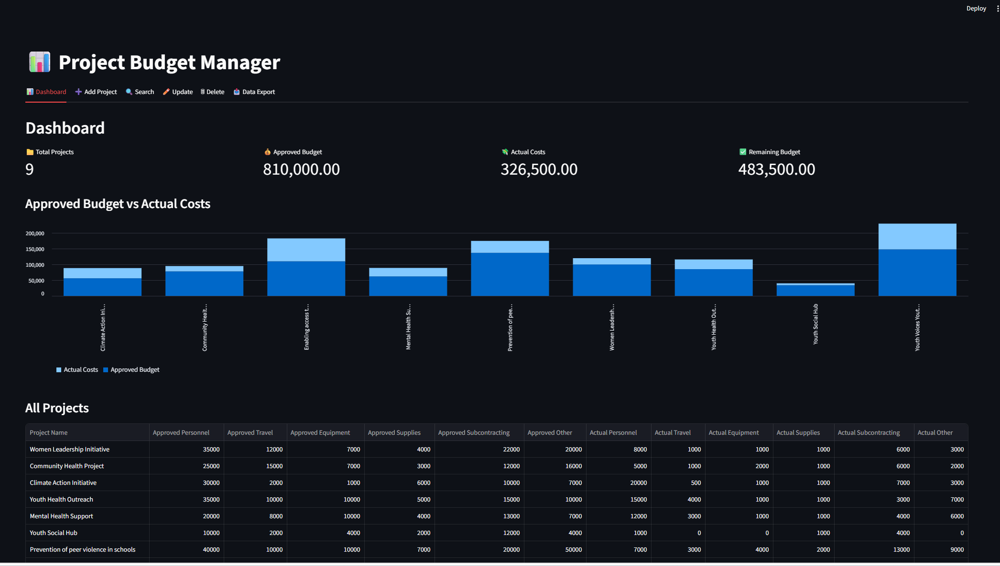

# 📊 Project Budget Manager


A web application built with **Python** and **Streamlit** for managing project budgets, tracking approved and actual costs, and monitoring project spending through an interactive dashboard.

---

## 🚀 Features

- 📊 Interactive dashboard with key project metrics
- ➕ Add new projects
- 🔍 Search existing projects
- ✏️ Update project information
- 🗑️ Delete projects
- 📈 Compare approved budgets with actual costs using charts
- 📥 Export project data to Excel
- 💾 Store project data in CSV format

---

## 🖼️ Application Preview

### Dashboard



---

## 🛠️ Built With

- Python
- Streamlit
- Pandas
- OpenPyXL

---

## 📂 Project Structure

```text
project-budget-manager-python/
│
├── images/
│   └── dashboard.png
├── streamlit_app.py
├── projects.csv
├── requirements.txt
├── README.md
└── .gitignore
```

---

## ⚙️ Installation

Clone the repository:

```bash
git clone https://github.com/aleksandrasremcev/project-budget-manager-python.git
```

Navigate to the project folder:

```bash
cd project-budget-manager-python
```

Install the required packages:

```bash
pip install -r requirements.txt
```

Run the application:

```bash
streamlit run streamlit_app.py
```

---

## 📋 Dashboard Overview

The dashboard provides an overview of all projects and includes:

- Total number of projects
- Total approved budget
- Total actual costs
- Remaining budget
- Budget comparison chart
- Complete project table

---

## 📊 Project Management

The application allows users to:

- Create new projects
- Track approved and actual costs across six budget categories
- Search for projects by name
- Update project information
- Delete projects
- Export all project data to Excel

---

## 🎯 Learning Objectives

This project was created to strengthen practical Python development skills while learning how to build interactive web applications.

Key concepts practiced include:

- Object and data management using dictionaries and lists
- Reading and writing CSV files with Pandas
- Building interactive user interfaces with Streamlit
- Creating dashboards and charts
- Implementing CRUD (Create, Read, Update, Delete) functionality
- Data validation
- Exporting data to Excel
- Using Git and GitHub for version control

---

## 👩‍💻 Author

**Aleksandra Sremcev**

GitHub: https://github.com/aleksandrasremcev